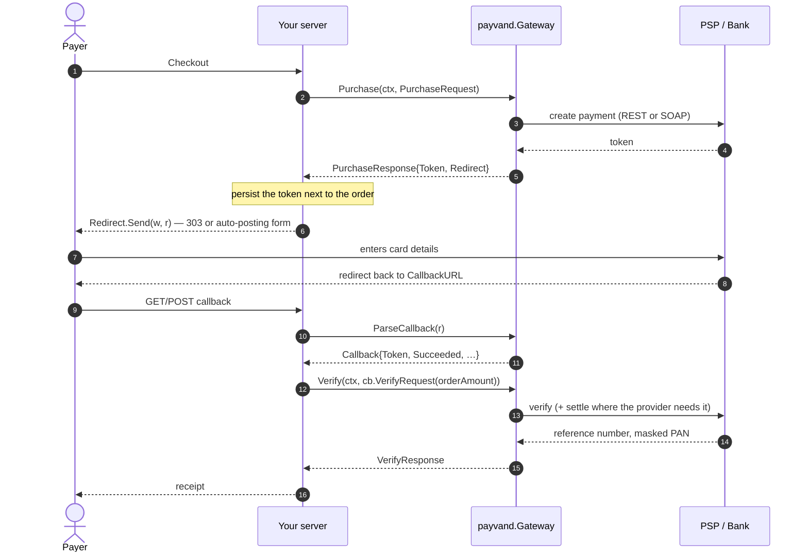
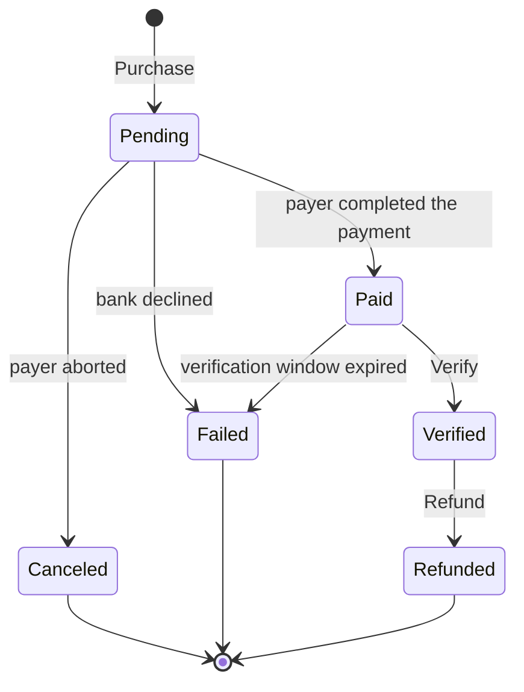

# Payvand

**One interface for every Iranian payment gateway.**

Payvand (پیوند — *the link*) is a Go package that puts every Iranian internet
payment gateway (IPG) behind a single, strategy-pattern interface: bank
acquirers, PSPs, aggregators and the buy-now-pay-later providers all answer the
same five methods. Swapping Zarinpal for Mellat — or for SnappPay — is a value
change, not a code change.

[](https://pkg.go.dev/github.com/amiranmanesh/payvand)


📖 [Documentation wiki](https://github.com/amiranmanesh/payvand/wiki) ·
🌐 [Website](https://amiranmanesh.github.io/payvand/) ·
🧭 [API reference](https://pkg.go.dev/github.com/amiranmanesh/payvand) ·
📝 [Changelog](CHANGELOG.md)

---

## Table of contents

- [Why Payvand](#why-payvand)
- [Install](#install)
- [Quick start](#quick-start)
- [How a payment flows](#how-a-payment-flows)
- [Architecture](#architecture)
- [Supported gateways](#supported-gateways)
- [Credentials per gateway](#credentials-per-gateway)
- [The interface](#the-interface)
- [Amounts: Rial and Toman](#amounts-rial-and-toman)
- [Redirecting the payer](#redirecting-the-payer)
- [Handling the callback](#handling-the-callback)
- [Options](#options)
- [Errors](#errors)
- [Testing your integration](#testing-your-integration)
- [Adding your own gateway](#adding-your-own-gateway)
- [Migrating an existing service](#migrating-an-existing-service)
- [Project layout](#project-layout)
- [Roadmap](#roadmap)
- [Development](#development)
- [License](#license)

---

## Why Payvand

| | |
|---|---|
| **Zero dependencies** | Nothing but the Go standard library. No SOAP library, no HTTP client, no logger. Audit it in an afternoon. |
| **One interface** | `Purchase`, `Verify`, `Refund`, `Inquiry`, `ParseCallback`. Every provider, same signatures. |
| **Capability aware** | Ask `gw.Capabilities()` instead of hard-coding "Zarinpal cannot refund". Unsupported operations return `ErrNotSupported`, never a surprise. |
| **Opt-in provider features** | Split settlement, fee modes, saved cards, service types — every provider extra is an option you may simply not pass. |
| **Amount safety** | `payvand.Toman(15_000)` and `payvand.Rial(150_000)` are the same money; each gateway converts to what its API wants. |
| **Callback parsing included** | The messy query-string / POST-form differences between the PSPs are normalised into one `Callback` struct. |
| **Testable by construction** | Every gateway accepts `WithBaseURL`, and a `virtual` in-memory gateway runs the whole cycle offline. |

---

## Install

```bash
go get github.com/amiranmanesh/payvand
```

```go
import "github.com/amiranmanesh/payvand"
```

Requires Go 1.26 or newer.

---

## Quick start

```go
package main

import (
	"context"
	"log"
	"time"

	"github.com/amiranmanesh/payvand"
)

func main() {
	// 1. Initialise once, with the settings shared by the whole application.
	pv := payvand.Init(payvand.WithTimeout(20 * time.Second))

	// 2. Build the gateway of the terminal you charge on.
	gw, err := pv.Gateway(payvand.Zarinpal, payvand.Config{
		MerchantKey: "00000000-0000-0000-0000-000000000000",
	})
	if err != nil {
		log.Fatal(err)
	}

	// 3. Create the payment.
	purchase, err := gw.Purchase(context.Background(), payvand.PurchaseRequest{
		Amount:      payvand.Toman(15_000),
		OrderID:     "1001",
		CallbackURL: "https://shop.example/payments/callback",
		Description: "Wallet top-up",
		Mobile:      "09120000000",
	})
	if err != nil {
		log.Fatal(err)
	}

	// Persist purchase.Token next to the order, then send the payer:
	//     purchase.Redirect.Send(w, r)
	_ = purchase
}
```

And the callback handler, written once for every provider:

```go
func callback(w http.ResponseWriter, r *http.Request) {
	cb, err := gw.ParseCallback(r)
	if err != nil || !cb.Succeeded {
		http.Error(w, "payment canceled", http.StatusPaymentRequired)
		return
	}

	order := orders.ByToken(cb.Token) // your own records

	// The amount always comes from your database, never from the browser.
	verified, err := gw.Verify(r.Context(), cb.VerifyRequest(order.Amount))
	if err != nil {
		http.Error(w, "payment not verified", http.StatusPaymentRequired)
		return
	}

	orders.MarkPaid(order.ID, verified.ReferenceNumber, verified.CardNumber)
}
```

Run the offline examples:

```bash
go run ./examples/basic         # one full cycle on the in-memory gateway
go run ./examples/multigateway  # capability table + provider switching
go run ./examples/webshop       # a two-handler shop on :8080
```

---

## How a payment flows



> **The verification step is not optional.** Most Iranian gateways reverse a
> transaction that is never verified, and some (Mellat, AsanPardakht) need an
> extra settlement call, which Payvand makes for you inside `Verify`.

> **`Verify` is also the amount check.** It compares what the provider says it
> settled against the amount you passed in, and refuses the settlement with
> `ErrAmountMismatch` when they disagree — which is what a token replayed from
> a cheaper payment looks like. Pass the amount from your own order record, not
> from the callback, and that check is doing real work for you.

State as Payvand reports it through `Inquiry`:



---

## Supported gateways

All twenty-five are implemented and covered by tests.

| Gateway | `payvand.…` | Kind | Redirect | Verify | Refund | Inquiry | Callback | Split settlement |
|---|---|---|---|---|---|---|---|---|
| Zarinpal | `Zarinpal` | REST | GET | ✅ | ➖ | ✅ | ✅ | ✅ (wages) |
| Zibal | `Zibal` | REST | GET | ✅ | ➖ | ✅ | ✅ | ✅ |
| Vandar | `Vandar` | REST | GET | ✅ | ✅ | ➖ | ✅ | ➖ |
| PayWeb | `PayWeb` | REST | GET | ✅ | ➖ | ➖ | ✅ | ➖ |
| IDPay | `IDPay` | REST | GET | ✅ | ➖ | ✅ | ✅ | ➖ |
| Pay.ir | `PayIr` | REST (form) | GET | ✅ | ➖ | ➖ | ✅ | ➖ |
| NextPay | `NextPay` | REST | GET | ✅ | ✅ | ➖ | ✅ | ➖ |
| PayPing | `PayPing` | REST v3 | GET | ✅ | ✅ | ✅ | ✅ | ✅ |
| BitPay.ir | `BitPay` | REST (form) | GET | ✅ | ➖ | ➖ | ✅ | ➖ |
| YekPay | `YekPay` | REST | GET | ✅ | ➖ | ➖ | ✅ | ➖ |
| Sadad / Bank Melli | `Sadad` | REST + 3DES | GET | ✅ | ➖ | ➖ | ✅ | ➖ |
| Parsian | `Parsian` | SOAP | GET | ✅ | ✅ | ➖ | ✅ | ✅ (IBAN) |
| Iran Kish | `IranKish` | REST + RSA/AES | POST | ✅ | ➖ | ➖ | ✅ | ➖ |
| Mellat (Behpardakht) | `Mellat` | SOAP | POST | ✅ | ✅ | ✅ | ✅ | ➖ |
| Saman (SEP) | `Saman` | REST | GET | ✅ | ✅ | ➖ | ✅ | ➖ |
| Pasargad | `Pasargad` | REST + RSA sign | GET | ✅ | ✅ | ✅ | ✅ | ➖ |
| AsanPardakht | `AsanPardakht` | REST v1 | POST | ✅ | ✅ | ✅ | ✅ | ✅ |
| Sepehr / Saderat | `Sepehr` | REST | POST | ✅ | ✅ | ➖ | ✅ | ➖ |
| TOP (Taban Ati Pardaz) | `Top` | REST, in-app | in-app | ✅ | ➖ | ✅ | ➖ | ➖ |
| Jibit (PPG v3) | `Jibit` | OAuth REST | GET | ✅ | ✅ | ✅ | ✅ | ➖ |
| SnappPay | `SnappPay` | OAuth REST, BNPL | GET | ✅ | ✅ | ✅ | ✅ | ➖ |
| TorobPay | `TorobPay` | OAuth REST, BNPL | GET | ✅ | ✅ | ✅ | ✅ | ➖ |
| Digipay | `DigiPay` | OAuth REST, wallet/BNPL | GET | ✅ | ✅ | ➖ | ✅ | ✅ (split) |
| Tara | `Tara` | OAuth REST, club credit | POST | ✅ | ➖ | ➖ | ✅ | ✅ (services) |
| Virtual (development) | `Virtual` | in-memory | GET | ✅ | ✅ | ✅ | ✅ | ➖ |

✅ supported · ➖ the provider offers no such API to merchants (the call returns
`payvand.ErrNotSupported`, and `Capabilities()` says so up front).

### Buy now, pay later

The last five providers lend rather than move money from a card, which shows up
in three places and nowhere else:

- **A basket is mandatory.** SnappPay, TorobPay, Digipay (credit and BNPL
  tickets) and Tara decide the credit from the goods, so each of them accepts a
  builder — `snapppay.WithCartBuilder`, `torobpay.WithCartBuilder`,
  `digipay.WithBasketBuilder`, `tara.WithInvoiceBuilder`. Leave it unset and
  Payvand sends one line covering the whole order, which is right for a top-up
  and wrong for a shop.
- **Settlement can be a second call.** `snapppay` verifies *and* settles inside
  `Verify`; turn the second half off with `snapppay.WithAutoSettle(false)` when
  your own code settles later. SnappPay reverts a payment that is verified and
  never settled, so this is not optional there.

  `torobpay` serves the same endpoint paths but is treated here as settling on
  its own, and `Verify` makes the one call. **Ask TorobPay which your contract
  is**, and switch `torobpay.WithSettle(true)` on if it expects the second call:
  a reversal for a missing settlement only surfaces once the window closes, long
  after a test payment looks successful.
- **Delivery matters.** Digipay only starts collecting instalments once the
  order is reported as shipped with `digipay.Deliver`.

Everything else — `Purchase`, `Verify`, `Refund`, `ParseCallback`, the redirect,
the errors — is the interface every other gateway implements.

---

## Credentials per gateway

`payvand.Config` is one struct for every provider; each gateway validates the
fields it needs at construction time, so a misconfigured terminal fails when
you wire it, not when a customer pays.

| Gateway | `MerchantKey` | `MerchantID` | `TerminalID` | `Username` | `Password` | `IBAN` |
|---|---|---|---|---|---|---|
| Zarinpal | merchant id | | | | | |
| Zibal | merchant | | | | | |
| Vandar | API key | business name (refunds) | | | | |
| PayWeb | bearer token | | | | | |
| IDPay | API key | | | | | |
| Pay.ir | API key | | | | | |
| NextPay | API key | | | | | |
| PayPing | bearer token | | | | | |
| BitPay.ir | API key | | | | | |
| YekPay | merchant id | | | | | |
| Sadad | base64 terminal key | merchant id | terminal id | | | |
| Parsian | login account (pin) | | | | | settlement IBAN |
| Iran Kish | acquirer RSA public key | | terminal id | acceptor id | terminal password | |
| Mellat | | | terminal id | user name | password | |
| Saman | | | terminal number | | | |
| Pasargad | RSA private key (PEM or .NET XML) | merchant code | terminal code | | | |
| AsanPardakht | | merchant configuration id | | `usr` | `pwd` | |
| Sepehr | | | terminal id | | | |
| TOP | EShop pin | | | | | |
| Jibit | API key | | | | secret key | |
| SnappPay | OAuth client secret | OAuth client id | | merchant user | merchant password | |
| TorobPay | OAuth client secret | OAuth client id | | merchant user | merchant password | |
| Digipay | OAuth client secret | OAuth client id | | merchant user | merchant password | |
| Tara | | | | merchant user | merchant password | |
| Virtual | — | — | — | — | — | — |

Anything a provider needs beyond these goes into `Config.Extra`, and every
gateway documents its own keys in its package documentation.

---

## The interface

```go
type Gateway interface {
	Name() Name
	Capabilities() Capabilities

	Purchase(ctx context.Context, req PurchaseRequest) (PurchaseResponse, error)
	Verify(ctx context.Context, req VerifyRequest) (VerifyResponse, error)
	Refund(ctx context.Context, req RefundRequest) (RefundResponse, error)
	Inquiry(ctx context.Context, req InquiryRequest) (InquiryResponse, error)
	ParseCallback(r *http.Request) (Callback, error)
}
```

Branch on capability, not on provider name:

```go
if gw.Capabilities().Refund {
	_, err = gw.Refund(ctx, payvand.RefundRequest{
		Token:           payment.Token,
		OrderID:         payment.OrderID,
		ReferenceNumber: payment.ReferenceNumber,
		Amount:          payment.Amount,
	})
}
```

---

## Amounts: Rial and Toman

Iranian providers disagree about the unit: most want Rial, PayPing works in
Toman throughout its API, and Zarinpal and NextPay terminals can be either.
Payvand keeps the caller's unit explicit and converts per gateway.

```go
payvand.Toman(15_000)          // 15,000 Toman
payvand.Rial(150_000)          // the same money
payvand.Toman(15_000).Rial()   // 150000
```

Never build `Money` from a browser-supplied value — read it from your order.

---

## Redirecting the payer

Some banks expect a plain redirect, others an HTML form POST (Mellat, Sepehr,
Iran Kish, AsanPardakht). `Redirect` covers both, so your handler never
branches:

```go
purchase.Redirect.Send(w, r)   // 303 for GET gateways, auto-submitting form for POST ones
```

If you render the page yourself:

```go
purchase.Redirect.String()     // the full URL, query parameters already appended
purchase.Redirect.IsPost()     // whether a form is required
purchase.Redirect.HTML()       // the auto-submitting form as a string
```

---

## Handling the callback

```go
cb, err := gw.ParseCallback(r)      // query string and POST form, merged and normalised
cb.Succeeded                        // the bank's own verdict — a hint, not proof
cb.Token, cb.OrderID                // matched against your records
cb.ReferenceNumber, cb.TraceNumber  // needed by Iran Kish, Mellat, Saman
cb.Get("digitalreceipt")            // provider specific values stay reachable

verified, err := gw.Verify(ctx, cb.VerifyRequest(order.Amount))
```

`cb.VerifyRequest(amount)` copies every field the provider will need —
including the ones only that provider uses — and takes the amount from you
rather than from the request.

The callback map travels into `VerifyRequest.Extra` unfiltered, because
gateways need the provider specific fields out of it. Everything security
relevant is decided against your own records or against what the provider says
on its own API, never against a value that came back through the browser — but
it does mean you should not read a settlement decision out of `Extra` yourself
either.

A payer who refreshes that page sends the callback twice. The second `Verify`
answers `ErrAlreadyVerified` on every provider that signals it, so handle that
case explicitly and do not fulfil the order again:

```go
verified, err := gw.Verify(ctx, cb.VerifyRequest(order.Amount))
switch {
case errors.Is(err, payvand.ErrAlreadyVerified):
	// already paid; answer from what you stored the first time
case err != nil:
	// not paid
}
```

---

## Options

Shared options, on `payvand`:

| Option | Effect |
|---|---|
| `WithTimeout(d)` | bounds one gateway call (default 30s) |
| `WithHTTPClient(c)` | supply your own client for tracing, proxying or mocking |
| `WithLogger(l)` | receive every request and response; `payvand.SlogLogger{Logger: …}` wraps `log/slog` |
| `WithSandbox(true)` | switch providers that have a test environment |
| `WithBaseURL(u)` | point the gateway at another host — sandboxes and tests |
| `WithRetry(n, backoff)` | retry network errors and 5xx responses |
| `WithHeader(k, v)`, `WithUserAgent(ua)` | extra headers |
| `WithSkipTLSVerify(true)` | last resort for a Shaparak host with an incomplete chain |

Provider options live in the gateway packages and are ordinary
`payvand.Option` values, so they compose in the same list:

```go
import "github.com/amiranmanesh/payvand/gateway/zibal"

gw, err := pv.Gateway(payvand.Zibal, cfg,
	payvand.WithSandbox(true),
	zibal.WithFeeMode(1),
	zibal.WithMobileCardCheck(true),
	zibal.WithMultiplexing(
		zibal.Share{BankAccount: "IR…", Amount: 90_000},
		zibal.Share{SubMerchantID: "sub-1", Amount: 60_000},
	),
)
```

A tour of what each package offers:

| Package | Options |
|---|---|
| `zarinpal` | `WithCurrency`, `WithWages`, `WithDefaultDescription` |
| `zibal` | `WithLedger`, `WithFeeMode`, `WithMobileCardCheck`, `WithMultiplexing`, `WithPercentMultiplexing`, `WithDefaultDescription` |
| `vandar` | `WithPort`, `WithComment`, `WithAccessToken`, `WithOrderAsFactorNumber`, `WithDefaultDescription` |
| `payweb` | `WithDefaultComment`, `WithCardRestriction` |
| `idpay` | `WithDefaultDescription` |
| `payir` | `WithOrderAsFactorNumber`, `WithDefaultDescription` |
| `nextpay` | `WithCurrency`, `WithAutoVerify`, `WithDefaultDescription` |
| `payping` | `WithPayerIdentity`, `WithReversible`, `WithBlockedSettlement`, `WithMultiplexing`, `WithDefaultDescription` |
| `bitpay` | `WithDefaultDescription` |
| `yekpay` | `WithCurrencies`, `WithAddress`, `WithDefaultDescription` |
| `sadad` | `WithApplicationName`, `WithAdditionalData`, `WithMobileAsUserID` |
| `parsian` | `WithMultiplexing`, `WithSettlementToIBAN`, `WithAdditionalData`, `WithMobileAsOriginator` |
| `irankish` | `WithTransactionType`, `WithMobileAsCmsID` |
| `mellat` | `WithAdditionalData`, `WithPayerID`, `WithoutSettle` |
| `saman` | `WithGetMethod`, `WithMobile` |
| `pasargad` | `WithAction`, `WithPayerDetails`, `WithoutTransactionCheck` |
| `asanpardakht` | `WithServiceType`, `WithPaymentID`, `WithSettlements`, `WithAdditionalData`, `WithoutSettlement`, `WithCancelInsteadOfReverse` |
| `sepehr` | `WithPayload`, `WithPayerDetails` |
| `top` | `WithAdditionalInfo`, `WithUserID`, `WithSetData` |
| `jibit` | `WithWage`, `WithUserIdentifier`, `WithPayerCardMatching`, `WithCancellableRefunds`, `WithAdditionalData`, `WithDefaultDescription` |
| `snapppay` | `WithCart`, `WithCartBuilder`, `WithDefaultCategory`, `WithPaymentMethod`, `WithAutoSettle`, `WithScope` |
| `torobpay` | `WithCart`, `WithCartBuilder`, `WithDefaultCategory`, `WithPaymentMethod`, `WithSettle` |
| `digipay` | `WithTicketType`, `WithAgent`, `WithAPIVersion`, `WithPreferredGateway`, `WithBasket`, `WithBasketBuilder`, `WithSplitDetails` |
| `tara` | `WithServiceID`, `WithInvoiceItems`, `WithInvoiceBuilder`, `WithDefaultGroup`, `WithDefaultUnit`, `WithClientIP` |
| `virtual` | `WithDecline`, `WithRedirectURL`, `WithFailingVerify` |

Nothing here is mandatory: leave an option out and the parameter is simply not
sent to the provider.

---

## Errors

Every failure is a `*payvand.Error` wrapping a sentinel, so you can match
broadly with `errors.Is` and still read the provider's own code:

```go
verified, err := gw.Verify(ctx, req)
switch {
case errors.Is(err, payvand.ErrAlreadyVerified):
	// a refreshed callback page — the order is already paid
case errors.Is(err, payvand.ErrAmountMismatch):
	// the bank settled a different amount: stop and investigate
case errors.Is(err, payvand.ErrPaymentFailed):
	var e *payvand.Error
	errors.As(err, &e)
	log.Printf("gateway %s said %s: %s", e.Gateway, e.Code, e.Message)
}
```

| Sentinel | Meaning |
|---|---|
| `ErrNotSupported` | the provider has no such API |
| `ErrGatewayNotRegistered` | unknown gateway name |
| `ErrInvalidConfig` | missing or malformed credentials |
| `ErrInvalidRequest` | the request cannot be sent (zero amount, missing order id, …) |
| `ErrPaymentFailed` | the provider rejected the operation |
| `ErrPaymentCanceled` | the payer aborted |
| `ErrAlreadyVerified` | the transaction was verified before |
| `ErrVerificationPending` | the provider is still settling; call `Verify` again |
| `ErrAmountMismatch` | the settled amount differs from the requested one |
| `ErrUnexpectedResponse` | the provider answered with something unreadable |

Three of them are worth handling explicitly. `ErrAlreadyVerified` is what a
refreshed callback page looks like on every gateway whose provider signals it,
so treat it as "already paid" rather than as a failure — never as a reason to
fulfil the order a second time. `ErrVerificationPending` (PayPing) means the
answer has not arrived yet: retry the verification, and do not send the payer
back to the bank. `ErrAmountMismatch` means the payment settled for something
other than what was ordered, which is the shape a replayed token takes: stop,
and reconcile by hand.

Gateways that publish a code table expose it as a function — `mellat.Message`,
`irankish.Message`, `saman.Message`, `nextpay.Message`, `bitpay.Message` — with
English texts.

---

## Testing your integration

**In your unit tests**, use the virtual gateway; it runs the whole cycle in
memory:

```go
gw, _ := payvand.New(payvand.Virtual, payvand.Config{})

purchase, _ := gw.Purchase(ctx, req)
cb, _ := gw.ParseCallback(httptest.NewRequest("GET", purchase.Redirect.String(), nil))
verified, err := gw.Verify(ctx, cb.VerifyRequest(req.Amount))
```

Failure paths are options: `virtual.WithDecline(true)`,
`virtual.WithFailingVerify(true)`.

**Against a fake provider**, point any gateway at an `httptest.Server`:

```go
server := httptest.NewServer(handler)
gw, _ := payvand.New(payvand.Zibal, cfg, payvand.WithBaseURL(server.URL))
```

That is exactly how Payvand's own twenty test packages work — no network, no
credentials:

```bash
make test        # go test -race ./...
make cover       # coverage summary
```

---

## Adding your own gateway

An in-house or not-yet-supported provider becomes a first class citizen by
implementing the interface and registering a factory:

```go
package acme

const Name core.Name = "acme"

func init() {
	core.Register(Name, func(cfg core.Config, opts ...core.Option) (core.Gateway, error) {
		return New(cfg, opts...)
	})
}

type Gateway struct {
	core.Unsupported // answers Refund/Inquiry/ParseCallback with ErrNotSupported
	// …
}
```

Embed `core.Unsupported` and override only what your provider actually does.
After a blank import of your package, `payvand.New("acme", cfg)` works like any
built-in gateway.

---

## Migrating an existing service

If your service already has an internal IPG layer with a `GetToken` /
`Confirm` / `Reverse` interface (the shape most Iranian Go services grew), the
move is mechanical:

| Your old code | Payvand |
|---|---|
| `NewIPG(cfg, db, gateway, terminalInfo)` | `pv.Gateway(name, payvand.Config{…})` |
| `GetToken(ctx, GetTokenReq{Amount, CallbackUrl, OrderID, Mobile})` | `Purchase(ctx, payvand.PurchaseRequest{…})` |
| `res.PaymentToken`, `res.URL` | `res.Token`, `res.Redirect` |
| `Confirm(ctx, ConfirmReq{PaymentToken, Amount, ReferenceNumber, TraceNumber})` | `Verify(ctx, payvand.VerifyRequest{…})` |
| `res.FinalReferenceNumber`, `res.CardNumber` | `res.ReferenceNumber`, `res.CardNumber` |
| `Reverse(ctx, ReverseReq{…})` | `Refund(ctx, payvand.RefundRequest{…})` |
| hand-parsed callback query/form | `ParseCallback(r)` + `Callback.VerifyRequest(amount)` |
| `amount int64` in Rial | `payvand.Rial(amount)` |
| a `switch` over gateway constants | the registry: the name is data |

A thin adapter keeps your existing call sites untouched while you migrate:

```go
type ipgAdapter struct{ gw payvand.Gateway }

func (a ipgAdapter) GetToken(ctx context.Context, req dto.GetTokenReq) (dto.GetTokenRes, error) {
	res, err := a.gw.Purchase(ctx, payvand.PurchaseRequest{
		Amount:      payvand.Rial(req.Amount),
		OrderID:     req.OrderID,
		CallbackURL: req.CallbackUrl,
		Mobile:      req.Mobile,
		NationalID:  req.NationalId,
	})
	if err != nil {
		return dto.GetTokenRes{}, err
	}
	return dto.GetTokenRes{PaymentToken: res.Token, URL: res.Redirect.String()}, nil
}
```

---

## Project layout

```
payvand/
├── payvand.go            # facade: names, aliases, Init/New, shared options
├── core/                 # the contracts: Gateway, DTOs, Money, errors, registry, Client
├── gateway/              # one package per provider, three files each
│   ├── zarinpal/  zibal/   vandar/  payweb/  idpay/    payir/
│   ├── nextpay/   payping/ bitpay/  yekpay/  sadad/    parsian/
│   ├── irankish/  top/     mellat/  saman/   pasargad/
│   ├── jibit/     snapppay/ torobpay/ digipay/ tara/
│   └── asanpardakht/ sepehr/ virtual/
├── internal/
│   ├── transport/        # net/http plumbing: retry, timeout, logging
│   ├── soap/             # SOAP 1.1 envelopes on encoding/xml
│   ├── cryptox/          # 3DES-ECB, AES-CBC, RSA sign/encrypt, PKCS#7, .NET XML keys
│   ├── tokenauth/        # bearer token cache, renew-and-replay on 401
│   ├── gwopt/            # per-gateway option storage
│   └── testutil/         # the fake provider the tests are written against
├── examples/             # basic, multigateway, webshop
├── Makefile
└── .github/workflows/ci.yml
```

---

## Roadmap

### Done

- [x] Provider independent `Gateway` interface with capability reporting
- [x] 24 real gateways plus an in-memory virtual one
- [x] Buy-now-pay-later providers behind the same interface: SnappPay, TorobPay, Digipay, Tara
- [x] Jibit's proxy payment gateway, with reversal and partial refunds
- [x] Purchase, verify, refund, inquiry and callback parsing
- [x] Multi-step settlement handled inside `Verify` (Mellat, AsanPardakht, Vandar, Pasargad, SnappPay)
- [x] OAuth bearer tokens cached and renewed transparently
- [x] Split settlement for Zarinpal, Zibal, Parsian and AsanPardakht
- [x] SOAP client, 3DES/AES/RSA envelopes and .NET XML key support, all on the standard library
- [x] Rial/Toman handling per provider
- [x] GET and POST redirects, including the auto-submitting form
- [x] Functional options per gateway, everything opt-in
- [x] Retry, timeout, logging and a pluggable HTTP client
- [x] Tests for every gateway, plus consumer level tests and runnable examples
- [x] Makefile and CI enforcing the "standard library only" rule

### Next

- [ ] Zarinpal refunds through the merchant OAuth token
- [ ] Sadad and Iran Kish reversal endpoints, once the contracts are confirmed
- [ ] IDPay and Zibal panel-level refunds
- [ ] Azki, Shepa, Rayanpay and Sepal gateways
- [ ] Bill payment and instalment transaction types where the provider offers them
- [ ] A recovery helper that reconciles lost callbacks through `Inquiry`
- [ ] Idempotency keys for retried purchases
- [ ] Persian translations of the provider response codes, next to the English ones
- [ ] Benchmarks and a fuzz corpus for the callback parsers

---

## Development

```bash
make help          # list the targets
make build         # compile everything
make test          # go test -race ./...
make lint          # gofmt check + go vet
make deps-check    # fail if a third party dependency appears in go.mod
make cover-html    # coverage report in the browser
make examples      # run the offline examples
```

Contributions are welcome. A new gateway is expected to bring:

1. `gateway/<name>/{<name>.go,dto.go,options.go}` following the existing shape,
2. a test package driven by `internal/testutil`, covering purchase, verify and
   callback at minimum,
3. its row in the tables above, and
4. no new dependency.

---

## License

MIT — see [LICENSE](LICENSE).
